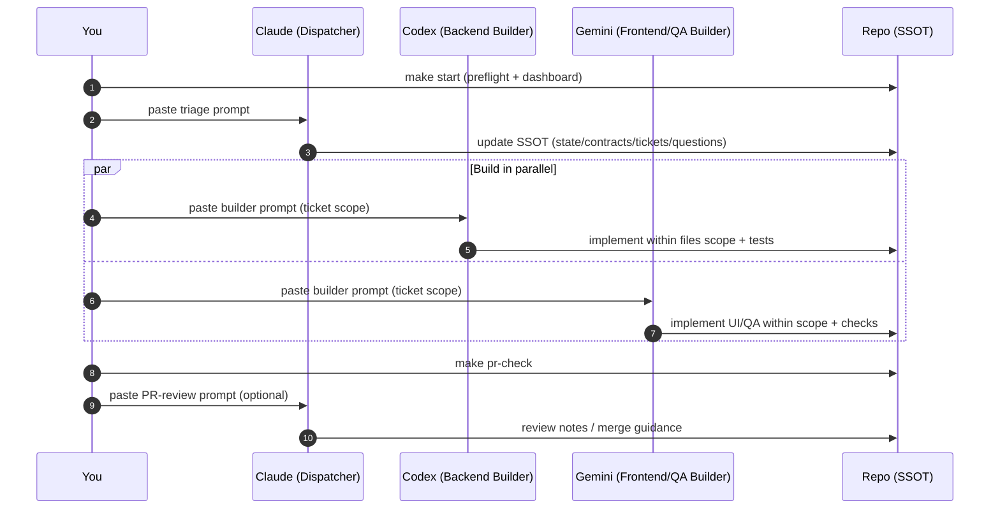

# Vibe Coding OS (Claude × Codex × Gemini) — **devos** Edition

A repo-first operating system for **multi-LLM parallel coding** that keeps you in flow.

- **Claude** → *Dispatcher* (plan → triage → tickets → review)
- **Codex** → *Backend/Infra Builder*
- **Gemini** → *Frontend/UI + QA Builder* (multimodal)

> **Principle:** Chat is not the source of truth. **The repo is.**  
> We prevent drift & collisions with **SSOT docs + queued decisions (A‑Mode) + ownership + contracts‑first**.

---

## Why this exists

Multi‑LLM coding usually fails for boring reasons:
- context drifts across chats
- multiple models edit overlapping files
- questions interrupt work and kill momentum

Vibe Coding OS turns that chaos into a repeatable process:
**repo‑based truth + queued decisions + role separation + minimal commands**.

---

## What you get

### ✅ Flow / UX
- **One‑command session start:** `make start`
- **Prompt delivery UX:** `make copy-*` (clipboard) or `make show-*` (print)
- **A‑Mode:** queue questions during work, answer them at session start

### ✅ Quality / Consistency
- **SSOT (Single Source of Truth)** in version control
- **Ownership rules** (file‑scoped tickets) to reduce collisions
- **Contracts‑first** (`API_CONTRACT`, `UI_CONTRACT`) to prevent silent breaks
- **3‑line handoff** for fast context transfer

---

## Repo layout (devos)

- **Code lives in repo root**: `apps/`, `backend/`, `frontend/`, `packages/`, `tests/`…
- **System/OS lives in `devos/`** (SSOT, queues, prompts, role files)

```
repo/
  Makefile              # wrapper (delegates to devos/Makefile)
  START_HERE.md         # quick entry point
  .github/              # PR template, etc.

  devos/
    AI.md
    CONTEXT.md
    PROJECT_STATE.md
    TASKS.md
    docs/
      API_CONTRACT.md
      UI_CONTRACT.md
      ARCHITECTURE.md
      ADR/
      PRD.md
      MANUAL_101.md
      SYSTEM_GUIDE.md
      PLAYBOOK.md
      REFERENCES.md
    tasks/QUEUE.yaml
    questions/QUEUE.md
    prompts/
    .claude/ .codex/ .gemini/
```

---

## Quickstart (GitHub‑first)

### 1) Create a GitHub repo (recommended: **empty**)
Default branch: `main`

### 2) Clone
```bash
git clone <your-repo-url>
cd <your-repo-folder>
```

### 3) Add this system
Copy this kit’s files into the repo root (keep `devos/` and the root `Makefile`).

### 4) Bootstrap
```bash
make preflight
make start
```

### 5) First commit
```bash
git add .
git commit -m "chore: bootstrap vibe coding OS (devos)"
git push -u origin main
```

---

## Daily workflow (remember just this)

```bash
make start
```

Then follow the dashboard:

1) **Claude triage**
```bash
make copy-claude
```
Paste into Claude and answer only queued choices (A/B/C/Default).

2) *(Optional)* **PRD intake**
- Put PRD in `devos/docs/PRD.md`
- Run:
```bash
make copy-prd-intake
```

3) **Builders in parallel**
```bash
make copy-codex
make copy-gemini
```

4) **Before opening a PR**
```bash
make pr-check
```

---

## How it works (diagrams)

### 1) Swimlane workflow (Claude / Codex / Gemini)



### 2) Truth order (what everyone should trust)

```mermaid
flowchart TB
  A[SSOT: devos/AI.md + CONTEXT.md + PROJECT_STATE.md] --> B[Queues: tasks/QUEUE.yaml + questions/QUEUE.md]
  B --> C[Contracts: docs/API_CONTRACT.md + docs/UI_CONTRACT.md]
  C --> D[Code: apps/* backend/* frontend/* packages/*]
  D --> E[Chat logs (least reliable)]
```

---

## A‑Mode (queued decisions)

**Rule:** don’t stop building to ask. Queue it.

- Add questions to `devos/questions/QUEUE.md` with:
  - **Options** (A/B/C/D)
  - **Recommendation**
  - **Default**
  - **Blocking / Non‑blocking**
- Resolve questions at session start (Claude triage)

Create a question template:
```bash
make new-question
```

---

## Ownership & collision rules

- **1 ticket = 1 PR**
- Tickets live in `devos/tasks/QUEUE.yaml`
- Each ticket includes a strict `files:` scope
- Builders edit **only** files in their scope

**Contracts‑first**
- If API behavior changes → update `devos/docs/API_CONTRACT.md` in the same PR
- If UI behavior changes → update `devos/docs/UI_CONTRACT.md` in the same PR

Create a ticket template:
```bash
make new-ticket
```

---

## Learn the system

- Manual 101 (follow‑along): `devos/docs/MANUAL_101.md`
- System Guide (overview): `devos/docs/SYSTEM_GUIDE.md`
- Playbook (process): `devos/docs/PLAYBOOK.md`
- References: `devos/docs/REFERENCES.md`

---

## FAQ

### Do I need to use all three models?
No. The system works with one model, but shines with **role separation**.

### What if clipboard copy fails (`pbcopy`)?
Use:
```bash
make show-codex
make show-claude
make show-gemini
```
Then paste manually.

### Is `devos/` required?
It’s recommended. It keeps OS files separate from your code, reducing repo clutter.

---

## Roadmap (ideas)
- Safer fallback for `copy-*` targets (auto‑print on clipboard failure)
- Optional git hooks for format/lint/test “always‑run” checks
- More sub‑agent prompts (verify, refactor, docs writer)

---

## Contributing
See `CONTRIBUTING.md`.  
If you fork/adapt, keep SSOT under `devos/` and keep the workflow simple.
