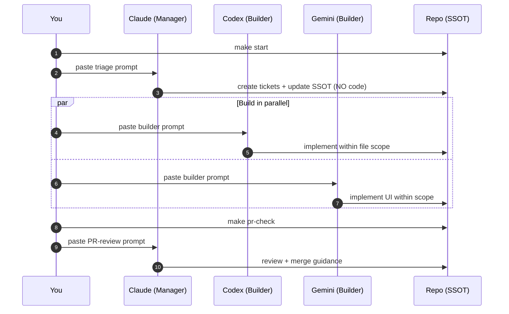
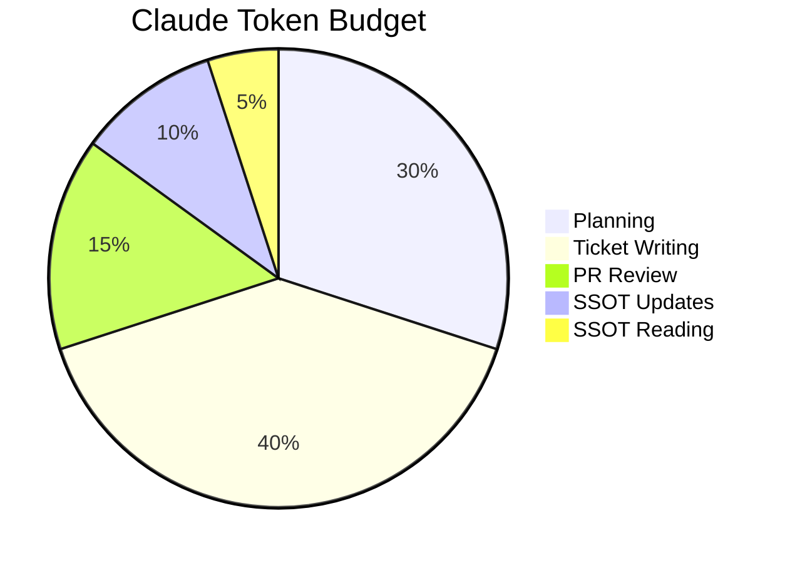

# Vibe Coding OS v1.5 (Claude x Codex x Gemini) — **devos** Edition

A repo-first operating system for **multi-LLM parallel coding** that keeps you in flow.

- **Claude** → *Manager* (plan → triage → tickets → review — NO implementation code)
- **Codex** → *Backend/Infra Builder*
- **Gemini** → *Frontend/UI + QA Builder* (multimodal)

> **Why multi-LLM?** Each LLM has limited tokens. Claude manages, Codex/Gemini build. Total capacity = sum of all agents.
> **Principle:** Chat is not the source of truth. **The repo is.**

---

## Why this exists

Multi-LLM coding usually fails for boring reasons:
- Claude runs out of tokens doing everything alone
- context drifts across chats
- multiple models edit overlapping files
- questions interrupt work and kill momentum

Vibe Coding OS solves this:
**manager/builder separation + repo-based truth + queued decisions + ownership + contracts-first**.

---

## What's new in v1.5

| Change | Before (v1.4) | After (v1.5) |
|--------|---------------|--------------|
| Claude role | "avoid production code" (loose) | "NO implementation code" (enforced + hooks) |
| CLAUDE.md | `devos/.claude/` (not auto-loaded) | Repo root `.claude/` (auto-loaded by Claude Code) |
| Ticket template | goal/dod/files | + context/spec (builders work independently) |
| Makefile | `kickoff` only | `start`, `copy-*`, `show-*` all working |
| Enforcement | None | Hooks (`guard-no-impl.sh`) block code writes |
| Builder prompts | Basic runbook | Boot Sequence + Deliverable Format |

---

## Repo layout

```
repo/
  .claude/
    CLAUDE.md             # Auto-loaded by Claude Code (manager rules)
    hooks/guard-no-impl.sh # Blocks Claude from writing impl code
    settings.json          # Hook configuration
  Makefile                 # Wrapper (delegates to devos/Makefile)
  START_HERE.md

  devos/
    AI.md                  # Operating rules (shared constitution)
    CONTEXT.md             # TL;DR (100 lines)
    PROJECT_STATE.md       # Current state
    TASKS.md               # Human task board view
    docs/                  # Contracts, ADR, architecture
    tasks/QUEUE.yaml       # Ticket queue (SSOT)
    questions/QUEUE.md     # Question queue (A-Mode)
    prompts/               # Session-start prompts per role
    .claude/ .codex/ .gemini/  # Role-specific rules
```

---

## Quickstart

### 1) Clone
```bash
git clone <your-repo-url>
cd <your-repo-folder>
```

### 2) Add this system
Copy this kit's files into the repo root (keep `devos/`, `.claude/`, and root `Makefile`).

### 3) Bootstrap
```bash
make start
```

### 4) First commit
```bash
git add .
git commit -m "chore: bootstrap vibe coding OS v1.5 (devos)"
git push -u origin main
```

---

## Daily workflow

```bash
make start
```

Then:

1) **Claude triage**
```bash
make copy-claude
```
Paste into Claude. Answer queued choices (A/B/C/Default).
Claude will create/update tickets — NOT write code.

2) **Builders in parallel**
```bash
make copy-codex    # paste into Codex
make copy-gemini   # paste into Gemini
```
Each builder works on their tickets independently.

3) **Before PR**
```bash
make pr-check
```

---

## How it works

### Swimlane workflow



### Token budget (why Claude doesn't code)



---

## A-Mode (queued decisions)

**Rule:** don't stop building to ask. Queue it.

```bash
make new-question
```

Add to `devos/questions/QUEUE.md` with Options + Default.
Resolve at session start via Claude triage.

---

## Ownership & collision rules

- **1 ticket = 1 PR**
- Each ticket has strict `files:` scope
- Builders edit **only** files in their scope
- **Contracts-first**: update docs before code

```bash
make new-ticket
```

---

## Learn the system

- System Guide: `devos/docs/SYSTEM_GUIDE.md`
- Playbook: `devos/docs/PLAYBOOK.md`
- Manual 101: `devos/docs/MANUAL_101.md`

---

## FAQ

### Do I need all three models?
No. But the system shines with **role separation** — Claude manages, others build.

### What if clipboard fails?
```bash
make show-claude
make show-codex
make show-gemini
```

### Why can't Claude write code?
Each LLM has limited tokens. If Claude spends tokens writing code, it can't manage.
Delegation = more total output.

---

## Contributing
See `CONTRIBUTING.md`.
If you fork/adapt, keep SSOT under `devos/` and keep the workflow simple.
