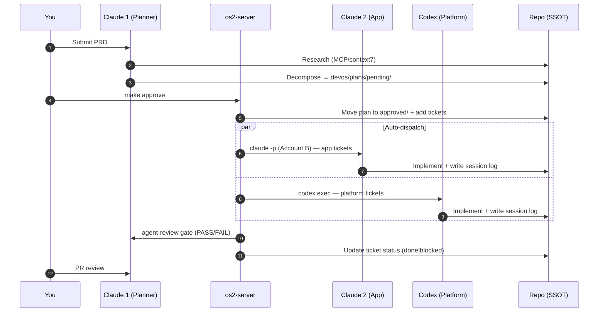
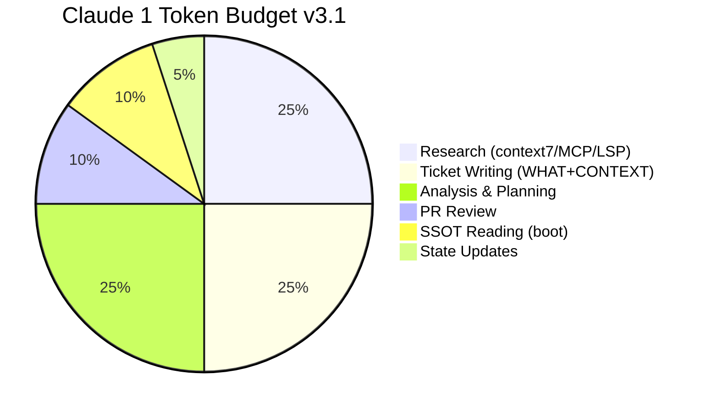

   

# Vibe Coding OS

**Run 3 AI coding agents in parallel — without them stepping on each other.**

One agent plans. Two agents build. The repo is the source of truth.
Submit a PRD, approve the plan, and watch Claude and Codex ship code simultaneously — no token exhaustion, no context drift, no file collisions.

[](../../generate)

---

## Why This Exists

Every developer who vibe-codes hits the same wall:

**Token exhaustion** — Your agent runs out of context halfway through a feature because it's planning, researching, *and* coding all at once.

**Context drift** — After three chat sessions, your agent has forgotten what it decided in session one. You're copy-pasting context between windows.

**File collisions** — Two agents edit the same file. One overwrites the other. You spend thirty minutes on merge conflicts that should never have existed.

**Momentum loss** — An agent stops to ask a question. You answer. It asks another. The build loop grinds to a halt.

| Without Vibe Coding OS | With Vibe Coding OS |
|---|---|
| 1 agent does everything, runs out of tokens | 3 specialized agents, each with a focused token budget |
| Context scattered across chat windows | Single source of truth in the repo |
| Agents overwrite each other's files | Strict file ownership per ticket |
| Blocked by questions, waiting for answers | Questions queued — agents keep building |
| Manual coordination between every step | Automated dispatch, quality gates, and chaining |

---

## How It Works

> **The repo is the source of truth. Not chat.**

All agent communication flows through files in `devos/` — no shared memory, no API calls between agents. What you commit is what every agent knows.

### Three Agents, Three Roles

| Agent | Role | Responsible for | Never does |
|-------|------|-----------------|------------|
| **Claude 1** | Planner + Researcher | Decompose PRDs · Research APIs · Write tickets · Review PRs | Write implementation code *(enforced by hook)* |
| **Claude 2** | App Builder | Backend logic · GUI design · Component architecture | Modify planning files · Make architectural decisions |
| **Codex** | Platform Builder | Infrastructure · Data layer · Tests · Scripts · Bulk changes | Modify planning files · Make architectural decisions |

### Full Cycle: PRD to Deployed Code


```mermaid
sequenceDiagram
  autonumber
  participant U as You
  participant C1 as Claude 1 (Planner)
  participant S as os2-server
  participant C2 as Claude 2 (App)
  participant X as Codex (Platform)
  participant R as Repo (SSOT)

  U->>C1: Submit PRD
  C1->>R: Research (MCP/context7)
  C1->>R: Decompose → devos/plans/pending/
  U->>S: make approve
  S->>R: Move plan to approved/ + add tickets

  par Auto-dispatch
    S->>C2: claude -p (Account B) — app tickets
    C2->>R: Implement + write session log
  and
    S->>X: codex exec — platform tickets
    X->>R: Implement + write session log
  end

  S->>C1: agent-review gate (PASS/FAIL)
  S->>R: Update ticket status (done|blocked)
  U->>C1: PR review
```

---

## Features

**Orchestration**
- **Automated dispatch** — Approve a plan once; agents start building automatically
- **Auto-chain** — When a ticket completes, newly unblocked downstream tickets dispatch without intervention
- **Collision prevention** — No two agents can touch the same file simultaneously; scope conflicts caught before dispatch

**Quality Gates**
- **4-stage pipeline** — Tests → secret scanning → AI code review → custom verification runs after every ticket
- **Auto-retry with rollback** — On gate failure, changes roll back (tracked *and* untracked files) and the agent retries
- **Agent-review** — Claude 1 verifies every diff against the ticket's acceptance criteria (PASS/FAIL verdict)
- **Baseline gates** — secret scan (gitleaks), contract sync, ticket file-scope, session-log presence, TDD first-commit check

**Testing Policy (Phase 3.5)**
- **Maturity ceiling** — contract + UI smoke + scenario integration tests (no full E2E)
- **Coverage gate** — Line 70% / Branch 60% with 3-ticket grace period per app
- **DOD error-case rule** — every success DOD requires a matching failure DOD
- **Partial TDD** — `tdd: required` on business logic; UI excluded by design
- **Hybrid authorship** — cross-test for logic (CODEX tests ↔ CLAUDE2 impl), self-test for UI
- **On-demand mutation testing** — Claude 1 proposes, user approves, overnight execution

**Communication**
- **Repo-as-SSOT** — All agent state lives in files; auditable, portable, no black-box memory
- **WHAT+CONTEXT tickets** — Claude 1 writes requirements and research context; builders decide how to implement
- **Async question queue (A-Mode)** — Agents queue questions with a default answer and keep building; blocking only when truly needed
- **Session logs** — Structured handoff logs give every agent cross-session visibility at next boot

**Flexibility**
- **Start with one agent** — Works with just Codex; Claude 2 (Account B) is additive for design-heavy work
- **Multi-machine support** — `make handoff` / `make pickup` for seamless machine switching
- **YAML-configured** — All agent settings, gates, and retry policies in one `os2.yaml`

---

## Get Started in 2 Minutes

### 1. Create your repo
Click **Use this template** above, or:
```bash
gh repo create my-project --template theprdguy/Vibe-Coding-OS --clone
cd my-project
```

### 2. Set up
```bash
make setup
```

### 3. Start the server
```bash
make start
```

### 4. Open Claude 1 and submit a PRD
```bash
claude
# Claude auto-reads .claude/CLAUDE.md and begins planning
```

### 5. Approve and watch agents build
```bash
make pending      # review the generated plan
make approve      # approve → tickets added → builders auto-dispatched
make queue        # watch progress
```

> **Only have Codex?** That's fine. Without Claude 2 configured, all builder tickets automatically route to Codex. Add Claude 2 any time with a second Claude account.

---

## Commands

| Category | Command | Description |
|----------|---------|-------------|
| **Setup** | `make setup` | First-time setup (CLI checks + venv + Claude 2 auth guide) |
| | `make install` | Python dependencies only |
| **Server** | `make start` | Start background server |
| | `make stop` | Stop server |
| | `make restart` | Restart server |
| | `make ps` | Server status check |
| | `make tail` | Live log tail |
| **Multi-machine** | `make handoff` | Stop + git push (switch to another machine) |
| | `make pickup` | Git pull + start (continue on another machine) |
| **Status** | `make status` | Project status |
| | `make queue` | Ticket queue |
| | `make logs` | Recent session logs |
| | `make pending` | Plans awaiting approval |
| **Approval** | `make approve` | Approve latest plan → auto-dispatch |
| | `make reject R='...'` | Reject with reason → Claude 1 revises |
| **Dispatch** | `make dispatch T=T-001` | Dispatch a single ticket |
| | `make dispatch-all` | Dispatch all todo tickets |
| **Gates** | `make test` | Run test suite |
| | `make scan-secrets` | Secret scan |
| | `make pr-check` | All pre-PR checks |

---

<details>
<summary><strong>Architecture Deep Dive</strong></summary>

### Repo layout

```
repo/
  AGENTS.md                  # Codex CLI native instruction file (auto-loaded)
  os2.yaml                   # Master config (agents, gates, dispatch settings)
  .claude/
    CLAUDE.md                # Claude 1 operating rules (auto-loaded)
    hooks/guard-no-impl.sh   # Blocks Claude 1 from writing impl code
    settings.json            # Hook + MCP server config
  .claude-b/
    CLAUDE.md                # Claude 2 operating rules (Account B)
  Makefile                   # Primary CLI interface
  requirements.txt           # pyyaml>=6.0, pytest>=8.0
  scripts/
    setup.sh                 # First-time setup script
    check-contract-sync.sh   # Baseline gate: contract files in sync
    check-ticket-scope.sh    # Baseline gate: diff stays within ticket files
    check-session-log.sh     # Baseline gate: session log written
    check-tdd-first-commit.sh # Baseline gate: TDD first-commit test presence
  tests/
    integration/             # Gate integration tests (bash)
    unit/                    # Schema unit tests (pytest)
  com.os2.server.plist       # macOS launchd config (always-on daemon)

  server/                    # os2-server (Python dispatcher)
    dispatcher.py            # Multi-agent dispatch + gate pipeline
    ssot.py                  # SSOT file readers/writers
    approval.py              # Plan approval state machine
    planner.py               # claude -p pipe mode wrapper
    config.py                # os2.yaml loader

  devos/                     # SSOT Brain
    AI.md                    # Shared agent constitution
    CONTEXT.md               # TL;DR (update each session)
    PROJECT_STATE.md         # Current state
    TASKS.md                 # Human task board view
    agents/registry.yaml     # 3-agent registry with scopes
    tasks/QUEUE.yaml         # Ticket queue (machine-readable)
    plans/                   # Approval workflow (pending/approved/rejected)
    logs/                    # Session logs (cross-agent visibility)
    questions/QUEUE.md       # Async question queue (A-Mode)
    docs/                    # Contracts, architecture, guides
```

### Why Claude 1 never writes code

Every agent has a finite token budget. When Claude 1 spends tokens writing implementation code, it can't plan, research, or review. Delegation multiplies total output.


```mermaid
pie title Claude 1 Token Budget v3.1
  "Research (context7/MCP/LSP)" : 25
  "Ticket Writing (WHAT+CONTEXT)" : 25
  "Analysis & Planning" : 25
  "PR Review" : 10
  "SSOT Reading (boot)" : 10
  "State Updates" : 5
```

### WHAT+CONTEXT ticket design

Claude 1 writes **WHAT** (behavioral requirements with verifiable acceptance criteria) and **CONTEXT** (API research, version constraints). Builders decide **HOW**.

```yaml
- id: T-123
  owner: CLAUDE2
  status: todo
  priority: high
  goal: "What to build — behavioral requirement"
  context: |
    Why it's needed + Claude 1's research findings
    (MCP/context7: latest API changes, version constraints)
  constraints:
    - "Technical constraint (versions, compatibility)"
  dod:
    - "POST /endpoint with valid input returns 200 + expected response"
    - "POST /endpoint with invalid input returns 400 + error message"
  files:
    - "apps/api/src/feature.ts"
  verify: "make pr-check"
  deps: []
  tdd: required         # required|skip|self-evident (v3.2)
  test_owner: CODEX     # who writes tests (cross-test for logic)
  impl_owner: CLAUDE2   # who writes implementation
```

### Gate pipeline

After each agent completes a ticket, the dispatcher runs:

```
1. make test          — test suite
2. make scan-secrets  — secret scan (gitleaks)
3. make pr-check      — baseline gates: contract-sync, ticket-scope,
                        session-log, TDD first-commit
4. agent-review       — Claude 1 reviews diff against DOD (PASS/FAIL)
5. ticket verify      — ticket-specific verify command
```

On gate failure: files roll back (tracked files restored from HEAD; untracked
files inside ticket scope removed) and the agent retries automatically.
Retry count is priority-based: critical → 3, high → 2, medium/low → 1.

### Auto-chain dispatch

When a ticket completes, the dispatcher re-scans the queue. Any ticket whose dependencies are now satisfied is dispatched automatically — no `make dispatch-all` needed between dependent tickets.

### Multi-machine daemon (optional)

Run os2-server as an always-on daemon on a sub-machine:

```bash
# Edit com.os2.server.plist — update WorkingDirectory to your project path
make install-daemon     # register with launchd (macOS)
make uninstall-daemon   # unregister
```

</details>

---

<details>
<summary><strong>FAQ</strong></summary>

**Do I need two Claude accounts?**
No. Without `.claude-b` credentials, CLAUDE2 tickets automatically fall back to Codex. You can add Claude 2 (Account B) at any time for better design judgment on GUI-heavy work.

**Do I need all three agents?**
No. The OS works with just Codex. Claude 2 is additive — it adds design judgment for frontend-heavy tasks.

**Why can't Claude 1 write code?**
Token budgets are finite. If Claude 1 spends tokens writing code, it can't plan or research effectively. Delegation = more total output across the team.

**What is Claude 1's Researcher role?**
Claude 1 has access to MCP/context7 and LSP tools that builders don't. It uses them to research latest library APIs and version constraints, then includes findings in each ticket's `context:` field. Builders get the research without having to do it themselves.

**What are session logs for?**
Builders write a structured log (≤50 lines) at session end. Claude 1 reads these logs at next boot to understand what was built, what decisions were made, and what's pending — no more context blindness between agents or between sessions.

**What does `make approve` do exactly?**
Moves the plan from `devos/plans/pending/` to `approved/`, writes all tickets to `QUEUE.yaml`, and auto-dispatches every `todo` ticket to its assigned agent.

**What if I already have a project?**
Use this as a template, then copy your existing codebase into the repo. Fill in `devos/CONTEXT.md` (what you're building, tech stack) and `devos/PROJECT_STATE.md` (current milestone), then submit your first PRD.

**Does this work on Linux?**
Yes, with one exception: the launchd daemon (`com.os2.server.plist`) is macOS-only. On Linux, use `systemd` or a `tmux` session for a persistent server. All other features work on Linux.

</details>

---

## Version History

| Version | Highlights |
|---------|------------|
| **v3.2** *(current)* | Testing maturity Phase 3.5 policy · `tdd`/`test_owner`/`impl_owner` schema · Baseline gates (contract-sync, ticket-scope, session-log, TDD first-commit) · Dispatcher rollback for untracked files · On-demand mutation testing protocol |
| v3.1 | Claude 2 (Account B) replaces Gemini · Auto-chain dispatch · Gate pipeline with auto-retry · `os2.yaml` config |
| v3.0 | os2-server · Plan approval workflow · Builder and Operation guides |
| v2.0 | Native instruction files · Session logs · Agent registry · WHAT+CONTEXT ticket design |
| v1.5 | Token-efficient multi-LLM OS |
| v1.0 | Initial release |

---

## Contributing

See [`CONTRIBUTING.md`](CONTRIBUTING.md).
If you fork or adapt this OS, keep SSOT under `devos/` and keep the workflow simple.

---

<p align="center">
  <b>Stop babysitting your AI agents. Let them run.</b><br><br>
  <a href="../../generate">Use this template</a> ·
  <a href="../../stargazers">Star this repo</a> ·
  <a href="../../issues">Report an issue</a>
</p>
