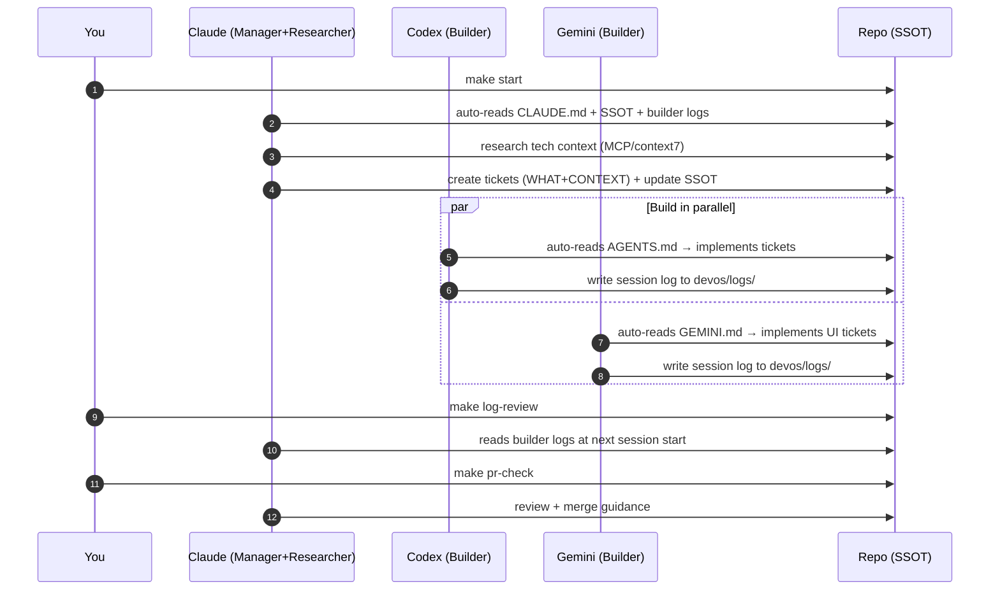
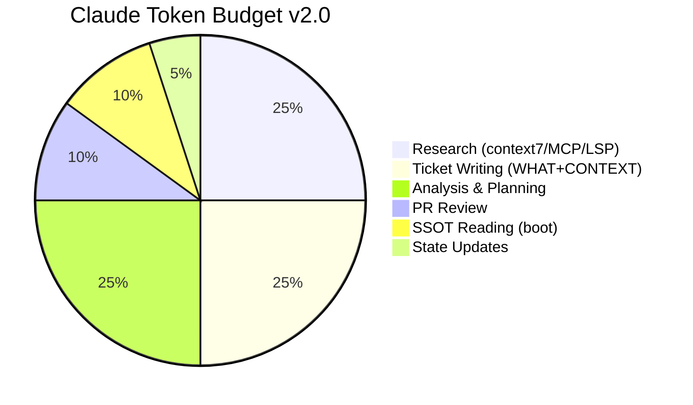

# Vibe Coding OS v2.0 (Claude x Codex x Gemini) — **devos** Edition

A repo-first operating system for **multi-LLM parallel coding** that keeps you in flow.

- **Claude** → *Manager + Researcher* (plan → research → tickets → review — NO implementation code)
- **Codex** → *Backend/Infra Builder* (auto-reads `AGENTS.md`)
- **Gemini** → *Frontend/UI + QA Builder* (auto-reads `GEMINI.md`)

> **Why multi-LLM?** Each LLM has limited tokens. Claude manages, Codex/Gemini build. Total capacity = sum of all agents.
> **Principle:** Chat is not the source of truth. **The repo is.**

---

## Why this exists

Multi-LLM coding usually fails for boring reasons:
- Claude runs out of tokens doing everything alone
- context drifts across chats
- multiple models edit overlapping files
- questions interrupt work and kill momentum

Vibe Coding OS solves this:
**manager/builder separation + repo-based truth + queued decisions + ownership + contracts-first**.

---

## What's new in v2.0

| Change | v1.5 | v2.0 |
|--------|------|------|
| Prompt delivery | `make copy-*` (clipboard) | Native instruction files (AGENTS.md, GEMINI.md) |
| Builder startup | Copy-paste prompt manually | CLI auto-reads instruction file on start |
| Cross-agent visibility | None | `devos/logs/` structured session logs |
| Agent management | Fixed 3 agents | `devos/agents/registry.yaml` (N-agent support) |
| Ticket design | Code-level spec | WHAT+CONTEXT (behavioral req + research context) |
| Claude role | Manager | Manager + Researcher (MCP/context7/LSP) |
| Handoff format | 3 lines | 4 lines (+Log) |
| Worktree support | None | `make worktree-create TICKET=T-xxx` |

---

## Repo layout

```
repo/
  AGENTS.md                # Codex CLI native instruction file (auto-loaded)
  GEMINI.md                # Gemini CLI native instruction file (auto-loaded)
  .claude/
    CLAUDE.md              # Auto-loaded by Claude Code (manager rules)
    CLAUDE-SECONDARY.md    # Second Claude instance template (inactive)
    hooks/guard-no-impl.sh # Blocks Claude from writing impl code
    settings.json          # Hook configuration
  Makefile                 # Wrapper (delegates to devos/Makefile)
  START_HERE.md

  devos/
    AI.md                  # Operating rules (shared constitution)
    CONTEXT.md             # TL;DR (100 lines)
    PROJECT_STATE.md       # Current state
    TASKS.md               # Human task board view
    agents/
      registry.yaml        # Agent registry (N-agent support)
    logs/                  # Session logs (cross-agent visibility)
      README.md
    docs/                  # Contracts, ADR, architecture
    tasks/QUEUE.yaml       # Ticket queue (SSOT)
    questions/QUEUE.md     # Question queue (A-Mode)
    .claude/ .codex/ .gemini/  # Role-specific quick references
```

---

## Quickstart

### 1) Use GitHub template
Go to this repo on GitHub → **Use this template** → Create your project repo.

### 2) Clone
```bash
git clone <your-repo-url>
cd <your-repo-folder>
```

### 3) Bootstrap
```bash
make start
```

### 4) First commit
```bash
git add .
git commit -m "chore: bootstrap vibe coding OS v2.0 (devos)"
git push -u origin main
```

---

## Daily workflow

```bash
make start
```

Then:

1) **Claude triage** — open Claude Code in this repo
Claude auto-reads `.claude/CLAUDE.md` and runs boot sequence.
It reads SSOT files + latest builder session logs → triages questions → reports status + next tickets.

2) **Builders in parallel** — open CLI in same repo
```bash
# Codex CLI (auto-reads AGENTS.md on start)
codex

# Gemini CLI (auto-reads GEMINI.md on start)
gemini
```
No clipboard needed. Each builder reads its instruction file automatically.

3) **After builder sessions** — check logs
```bash
make log-review
```
Review what each builder accomplished.

4) **Before PR**
```bash
make pr-check
```

---

## How it works

### Swimlane workflow


```mermaid
sequenceDiagram
  autonumber
  participant U as You
  participant C as Claude (Manager+Researcher)
  participant X as Codex (Builder)
  participant G as Gemini (Builder)
  participant R as Repo (SSOT)

  U->>R: make start
  C->>R: auto-reads CLAUDE.md + SSOT + builder logs
  C->>R: research tech context (MCP/context7)
  C->>R: create tickets (WHAT+CONTEXT) + update SSOT

  par Build in parallel
    X->>R: auto-reads AGENTS.md → implements tickets
    X->>R: write session log to devos/logs/
  and
    G->>R: auto-reads GEMINI.md → implements UI tickets
    G->>R: write session log to devos/logs/
  end

  U->>R: make log-review
  C->>R: reads builder logs at next session start
  U->>R: make pr-check
  C->>R: review + merge guidance
```

### Token budget (why Claude doesn't code)


```mermaid
pie title Claude Token Budget v2.0
  "Research (context7/MCP/LSP)" : 25
  "Ticket Writing (WHAT+CONTEXT)" : 25
  "Analysis & Planning" : 25
  "PR Review" : 10
  "SSOT Reading (boot)" : 10
  "State Updates" : 5
```

---

## WHAT+CONTEXT ticket design

Claude writes **WHAT** (behavioral requirements) and **CONTEXT** (research findings).
Builders decide **HOW** (implementation approach, code structure, patterns).

```yaml
- id: T-123
  status: todo
  owner: CODEX
  goal: "What to build — behavioral requirement"
  context: |
    Why it's needed + Claude's research findings
    (MCP/context7: latest API changes, version constraints)
  constraints: |
    Technical constraints (versions, compatibility, deps)
  dod:
    - "Acceptance criteria (behavior-based)"
  files:
    - "Files/directories to modify"
  skills_hint: []
  verify:
    - "make pr-check"
```

---

## Session logs

Builders write structured logs to `devos/logs/` at session end.
Claude reads them at next boot to understand cross-agent context.

```bash
make logs          # list recent logs
make log-review    # show latest log per agent
```

---

## Agent registry

All agents registered in `devos/agents/registry.yaml`:
- `claude-dispatcher` — Manager + Researcher
- `codex-builder` — Backend/Infra Builder
- `gemini-builder` — Frontend/UI Builder
- `claude-secondary` — (inactive, pre-registered for future use)

```bash
make agents        # list registered agents and status
```

---

## Worktree support

Run parallel tickets in isolated environments:

```bash
make worktree-create TICKET=T-123   # create worktrees/T-123/ on feat/T-123 branch
make worktree-list                   # list active worktrees
make worktree-clean                  # remove merged worktrees
```

---

## A-Mode (queued decisions)

**Rule:** don't stop building to ask. Queue it.

```bash
make new-question
```

Add to `devos/questions/QUEUE.md` with Options + Default.
Resolve at session start via Claude triage.

---

## Ownership & collision rules

- **1 ticket = 1 PR**
- Each ticket has strict `files:` scope
- Builders edit **only** files in their scope
- **Contracts-first**: update docs before code

```bash
make new-ticket
```

---

## Learn the system

- System Guide: `devos/docs/SYSTEM_GUIDE.md`
- Playbook: `devos/docs/PLAYBOOK.md`
- Manual 101: `devos/docs/MANUAL_101.md`

---

## FAQ

### Do I need all three models?
No. But the system shines with **role separation** — Claude manages, others build.

### Do I still need copy-paste?
No. In v2.0, Codex CLI auto-reads `AGENTS.md` and Gemini CLI auto-reads `GEMINI.md` on startup.
`make copy-*` is retained as a deprecated fallback.

### Why can't Claude write code?
Each LLM has limited tokens. If Claude spends tokens writing code, it can't manage.
Delegation = more total output.

### What is Claude's Researcher role?
Claude has MCP/context7/LSP tools that builders lack. Claude uses them to research
latest library APIs and version constraints, then includes findings in ticket `context:`.
This bridges the tool asymmetry between Claude and the builders.

### What is the session log for?
Builders write a structured log (≤50 lines) at session end. Claude reads these logs
at boot to understand what was built, what decisions were made, and what's pending.
No more context blindness between LLMs.

---

## Contributing
See `CONTRIBUTING.md`.
If you fork/adapt, keep SSOT under `devos/` and keep the workflow simple.
